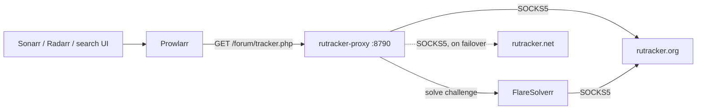

# prowlarr_rutracker_proxy

A reverse proxy that sits between **Prowlarr** and **RuTracker** and makes the
tracker reachable, logged in, and unblocked — without patching Prowlarr.

You point the RuTracker indexer's **Base Url** at it. From there it:

- **solves Cloudflare / DDoS-Guard challenges** through FlareSolverr,
- **routes everything through a SOCKS5 proxy**, both its own requests and the
  browser FlareSolverr drives,
- **falls back from `rutracker.org` to `rutracker.net`** while rewriting every
  response so the mirror in use never leaks,
- **owns the tracker login**, so the session survives restarts and a captcha can
  be answered in one place.



## Why the Base Url can be changed at all

Prowlarr's RuTracker indexer is a **C# indexer**
([`RuTracker.cs`](https://github.com/Prowlarr/Prowlarr/blob/develop/src/NzbDrone.Core/Indexers/Definitions/RuTracker.cs)),
not a Cardigann YAML definition, and its *Base Url* renders as a dropdown built
from the site links compiled into it. That is a **UI constraint only**:
`IndexerFactory.Create`/`Update` overwrite `definition.IndexerUrls` but never
validate or reset `Settings.BaseUrl`, so the API accepts any address.
`scripts/configure_proxy.py` sets it over the API.

The **trailing slash is required**. Prowlarr builds every link by concatenating
`BaseUrl + "forum/" + href`, so without it you get `...8790forum/`.

Because Prowlarr talks plain HTTP to this service and the service does the HTTPS
leg itself, there is no TLS interception and no certificate to install anywhere.

## The login is the proxy's, not Prowlarr's

Prowlarr's indexer would normally POST to `forum/login.php` and keep the cookie
itself. That cookie is somewhere nothing can help it: a challenge on the login
page cannot be solved, a captcha cannot be shown to you, and every restart starts
over.

So the proxy answers `login.php` itself — Prowlarr gets a synthetic page carrying
the `id="logged-in-username"` marker its indexer looks for — and logs in
separately with the credentials in **this container's** environment, persisting
`bb_session` to `./data`.

> **Leave the username and password on the Prowlarr indexer blank.** They are
> ignored. `RUTRACKER_USERNAME` / `RUTRACKER_PASSWORD` in `.env` are what get used.

If RuTracker demands a captcha, the login stops and says so. Fetch the image from
`http://localhost:8790/captcha`, then finish the login:

```
curl -X POST 'http://localhost:8790/login' --data 'code=WHATEVER_IT_SAYS'
```

## Mirror failover

`RUTRACKER_MIRRORS` is tried in order and the **first entry is canonical**. When
a mirror fails `MIRROR_FAIL_THRESHOLD` times in a row the next takes over, and
the preferred one is probed again after `MIRROR_RECHECK_SECONDS`.

Whatever mirror actually answered, its hostname is rewritten back to the
canonical one — in the body, in `Location`, and in `Set-Cookie` domains — so no
mirror ever leaks into what Prowlarr parses. The rewrite is done on raw bytes
rather than decoded text on purpose: RuTracker serves **windows-1251**, and
hostnames are ASCII, so byte substitution is both encoding-safe and cheaper than
a decode/encode round trip.

Redirects and cookies are then pointed back at this service rather than the
tracker, so a `Location` never sends Prowlarr at the blocked origin.

## Cloudflare clearance is per-path

A `cf_clearance` cookie is scoped to the Cloudflare rule that issued it. A
clearance won on `index.php` is **rejected by `login.php`**, which is protected
harder, so the proxy always solves the challenge on the path that was actually
blocked. Asking FlareSolverr to solve an unchallenged page returns
`Challenge not detected` and a cookie that clears nothing.

FlareSolverr's browser is Chrome, whose `--proxy-server` has **no `socks5h`
scheme** — it fails the whole connection with `ERR_INTERNET_DISCONNECTED`. Chrome's
`socks5://` already resolves DNS at the far end, which is what `socks5h` means to
`requests`, so `SOCKS5_URL` is normalised for FlareSolverr and left alone for the
upstream client.

## Quick start

```
cp .env.example .env          # credentials + SOCKS5 endpoint
docker compose up -d --build
set -a; source .env; set +a   # the scripts read these from the environment
python3 scripts/configure_proxy.py
```

In Prowlarr, add the **RuTracker** indexer with a blank username and password
first. `scripts/configure_proxy.py` then points its Base Url at this service and
clears the tag and Http indexer proxy that older versions of this project needed.

By default it sets `http://rutracker-proxy:8790/`, which works when Prowlarr is
the container in this compose file. For a Prowlarr elsewhere, pass an address it
can actually route to:

```
python3 scripts/configure_proxy.py http://192.168.1.10:8790/
```

## Verifying

```
python3 scripts/test_proxy.py      # the proxy alone: login, search, download
python3 scripts/test_indexer.py    # end to end through Prowlarr
```

`test_proxy.py` checks that the session is logged in, that a search returns rows,
that no foreign mirror hostname leaks into the page, and that a download link
yields bytes starting with `d8:announce` rather than an HTML error page.

## Layout

```
docker-compose.yml                    Prowlarr + the proxy + FlareSolverr
Dockerfile                            the proxy image
proxy/config.py                       every environment knob, in one place
proxy/upstream.py                     SOCKS5, mirror failover, hostname rewriting
proxy/session.py                      login, bb_session/cf_clearance, captcha handling
proxy/flaresolverr.py                 challenge detection and solving
proxy/app.py                          the listener: routing and local endpoints
scripts/configure_proxy.py            sets the indexer's Base Url, via the Prowlarr API
scripts/test_proxy.py                 the proxy alone
scripts/test_indexer.py               end to end through Prowlarr
```

## Endpoints

| Endpoint | What it does |
| --- | --- |
| `/forum/...` | the tracker itself |
| `GET /healthz` | liveness probe, used by the container healthcheck |
| `GET /` | what this service is and how it is wired |
| `GET /status` | active mirror, session age, clearance cookies, last error |
| `GET /captcha` | the pending login captcha image, when there is one |
| `POST /login` | finish a captcha-blocked login: `code=<value>` |

## Configuration

| Variable | Default | Meaning |
| --- | --- | --- |
| `RUTRACKER_USERNAME` / `RUTRACKER_PASSWORD` | — | the account the proxy logs in with |
| `SOCKS5_URL` | — | e.g. `socks5h://host:1080`; empty means go direct |
| `RUTRACKER_MIRRORS` | `https://rutracker.org,https://rutracker.net` | first entry is canonical |
| `FLARESOLVERR_URL` | `http://flaresolverr:8191` | set empty, or `FLARESOLVERR_ENABLED=false`, to disable |
| `FLARESOLVERR_TIMEOUT_MS` | `60000` | per-solve budget |
| `FLARESOLVERR_SESSION_TTL_MINUTES` | `30` | `0` launches a fresh browser per solve |
| `MIRROR_FAIL_THRESHOLD` | `2` | consecutive failures before switching mirror |
| `MIRROR_RECHECK_SECONDS` | `900` | how long a demoted mirror stays demoted |
| `REQUEST_DELAY` | `0.25` | minimum gap between upstream requests, in seconds |
| `HTTP_TIMEOUT` | `30` | per-request timeout, in seconds |
| `PROXY_PORT` | `8790` | listener port |
| `STATE_DIR` | `/data` | where the session lives |
| `LOG_LEVEL` | `INFO` | `DEBUG` logs every upstream URL |

`PROWLARR_URL` and `PROWLARR_API_KEY` are read by the scripts from the
environment, not by the containers. Compose loads `.env` for the services, but
your shell does not — `set -a; source .env; set +a` first.

## Security

This service answers **origin-form requests only**; an absolute-form request is
rejected, so it cannot be used as a forward proxy. It has no authentication,
though, and anyone who can reach it can search the tracker as your account and
download torrents through your session. Expose port 8790 only on a network
Prowlarr and you control, never the public internet.

`RUTRACKER_PASSWORD` and the `bb_session` cookie in `./data` are credentials for
your tracker account. `data/` and `.env` are both in `.gitignore`.
