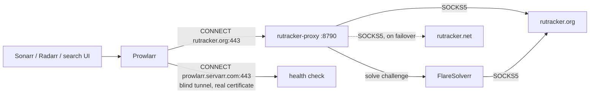

# prowlarr_rutracker_proxy

An HTTP proxy that sits between **Prowlarr** and **RuTracker** and makes the
tracker reachable, logged in, and unblocked — without patching Prowlarr.

It is added in Prowlarr as an **Http indexer proxy** and attached to the
RuTracker indexer with a tag. From there it:

- **solves Cloudflare / DDoS-Guard challenges** through FlareSolverr,
- **routes everything through a SOCKS5 proxy**, both its own requests and the
  browser FlareSolverr drives,
- **falls back from `rutracker.org` to `rutracker.net`** while rewriting every
  response so Prowlarr only ever sees `rutracker.org`,
- **owns the tracker login**, so the session survives restarts and a captcha can
  be answered in one place.

## Why it has to MITM

Prowlarr's RuTracker indexer is a **C# indexer**
([`RuTracker.cs`](https://github.com/Prowlarr/Prowlarr/blob/develop/src/NzbDrone.Core/Indexers/Definitions/RuTracker.cs)),
not a Cardigann YAML definition. Its *Base Url* is a dropdown built from the site
links compiled into it — `https://rutracker.org/` and `https://rutracker.net/` —
so there is no way to point it at a plain-HTTP origin and have a proxy answer in
absolute form.

Everything therefore arrives as `CONNECT rutracker.org:443`, and the only way to
see inside is to terminate that TLS locally with a certificate Prowlarr trusts.
The proxy generates its own CA on first boot for exactly that, and uses it **only**
for the hosts in `MITM_HOSTS`:



Prowlarr validates an indexer proxy by fetching `prowlarr.servarr.com` through
it, so anything that is not RuTracker is passed through as an untouched TCP
tunnel and keeps its real certificate.

## The login is the proxy's, not Prowlarr's

Prowlarr's indexer would normally POST to `forum/login.php` and keep the cookie
itself. That cookie is somewhere nothing can help it: a challenge on the login
page cannot be solved, a captcha cannot be shown to you, and every restart starts
over.

So the proxy answers `login.php` itself — Prowlarr gets a synthetic page carrying
the `id="logged-in-username"` marker its indexer looks for — and logs in
separately with the credentials in **this container's** environment, persisting
`bb_session` to `./data`.

> **Leave the username and password on the Prowlarr indexer blank.** They are
> ignored. `RUTRACKER_USERNAME` / `RUTRACKER_PASSWORD` in `.env` are what get used.

If RuTracker demands a captcha, the login stops and says so. Fetch the image from
`http://localhost:8790/captcha`, then finish the login:

```
curl -X POST 'http://localhost:8790/login' --data 'code=WHATEVER_IT_SAYS'
```

## Mirror failover

`RUTRACKER_MIRRORS` is tried in order and the **first entry is canonical**. When
a mirror fails `MIRROR_FAIL_THRESHOLD` times in a row the next takes over, and
the preferred one is probed again after `MIRROR_RECHECK_SECONDS`.

Whatever mirror actually answered, its hostname is rewritten back to the
canonical one — in the body, in `Location`, and in `Set-Cookie` domains — so
every link Prowlarr parses says `rutracker.org` and comes back through here. The
rewrite is done on raw bytes rather than decoded text on purpose: RuTracker
serves **windows-1251**, and hostnames are ASCII, so byte substitution is both
encoding-safe and cheaper than a decode/encode round trip.

## Quick start

```
cp .env.example .env          # credentials + SOCKS5 endpoint
docker compose up -d --build  # generates ./data/ca/ca.crt on first boot
docker compose restart prowlarr
python3 scripts/configure_proxy.py
```

Step 3 is not optional: the init script in `prowlarr-init/` installs the proxy's
CA into Prowlarr's trust store, and it can only do that once the CA exists.

Then, in Prowlarr, add the **RuTracker** indexer with a blank username and
password. `scripts/configure_proxy.py` creates the tag, creates the Http indexer
proxy, and attaches the tag to that indexer.

### If Prowlarr skips the init script

linuxserver images refuse to run files in `/custom-cont-init.d` that are not
owned by root:

```
sudo chown root:root prowlarr-init/*.sh && chmod 755 prowlarr-init/*.sh
```

You can always install the CA by hand instead:

```
docker compose exec prowlarr sh -c \
  'cp /rutracker-ca/ca.crt /usr/local/share/ca-certificates/ && update-ca-certificates'
docker compose restart prowlarr
```

## Verifying

```
python3 scripts/test_proxy.py      # the proxy alone: tunnel, MITM, login, search, download
python3 scripts/test_indexer.py    # end to end through Prowlarr
```

`test_proxy.py` deliberately checks that `prowlarr.servarr.com` is *not*
intercepted, that `rutracker.net` never leaks into a response, and that a
download link yields bytes starting with `d8:announce` rather than an HTML error
page.

## Layout

```
docker-compose.yml                    Prowlarr + the proxy + FlareSolverr
Dockerfile                            the proxy image
proxy/config.py                       every environment knob, in one place
proxy/ca.py                           the CA, and a leaf certificate per intercepted host
proxy/upstream.py                     SOCKS5, mirror failover, hostname rewriting
proxy/session.py                      login, bb_session/cf_clearance, captcha handling
proxy/flaresolverr.py                 challenge detection and solving
proxy/app.py                          the listener: CONNECT split, routing, local endpoints
prowlarr-init/                        installs the CA into the Prowlarr container
scripts/configure_proxy.py            tag + indexer proxy + indexer, via the Prowlarr API
scripts/test_proxy.py                 the proxy alone
scripts/test_indexer.py               end to end through Prowlarr
```

## Endpoints

| Endpoint | What it does |
| --- | --- |
| `GET /healthz` | liveness probe, used by the container healthcheck |
| `GET /` | what this service is and how it is wired |
| `GET /status` | active mirror, session age, clearance cookies, last error |
| `GET /ca.crt` | the CA to trust in Prowlarr |
| `GET /captcha` | the pending login captcha image, when there is one |
| `POST /login` | finish a captcha-blocked login: `code=<value>` |

## Configuration

| Variable | Default | Meaning |
| --- | --- | --- |
| `RUTRACKER_USERNAME` / `RUTRACKER_PASSWORD` | — | the account the proxy logs in with |
| `SOCKS5_URL` | — | e.g. `socks5h://host:1080`; empty means go direct |
| `RUTRACKER_MIRRORS` | `https://rutracker.org,https://rutracker.net` | first entry is canonical |
| `MITM_HOSTS` | `rutracker.org,rutracker.net` | the only hosts whose TLS is terminated |
| `SOCKS_TUNNEL_SUFFIXES` | `rutracker.org,rutracker.net,rutracker.cc,rutracker.nl` | tunnelled hosts that still go via SOCKS5 |
| `FLARESOLVERR_URL` | `http://flaresolverr:8191` | set empty, or `FLARESOLVERR_ENABLED=false`, to disable |
| `FLARESOLVERR_TIMEOUT_MS` | `60000` | per-solve budget |
| `FLARESOLVERR_SESSION_TTL_MINUTES` | `30` | `0` launches a fresh browser per solve |
| `MIRROR_FAIL_THRESHOLD` | `2` | consecutive failures before switching mirror |
| `MIRROR_RECHECK_SECONDS` | `900` | how long a demoted mirror stays demoted |
| `REQUEST_DELAY` | `0.25` | minimum gap between upstream requests, in seconds |
| `HTTP_TIMEOUT` | `30` | per-request timeout, in seconds |
| `PROXY_PORT` | `8790` | listener port |
| `STATE_DIR` / `CA_DIR` | `/data`, `/data/ca` | where the session and the CA live |
| `LOG_LEVEL` | `INFO` | `DEBUG` logs every upstream URL |

## Security

The CA in `./data/ca` is a **trust anchor**: anything that trusts it will accept
a certificate it signs for *any* host. So:

- it is generated per deployment on first boot, never shipped in the image and
  never committed (`data/` is in `.gitignore`);
- the private key is written `0600`;
- only the hosts in `MITM_HOSTS` are ever intercepted — everything else is
  blind-tunnelled and keeps its real certificate;
- upstream TLS is **verified** normally; the proxy never disables verification.

Do not expose port 8790 beyond the host or the compose network. It is a forward
proxy, and while plain-HTTP relaying is restricted to RuTracker, `CONNECT` has to
stay open for Prowlarr's own health check.
